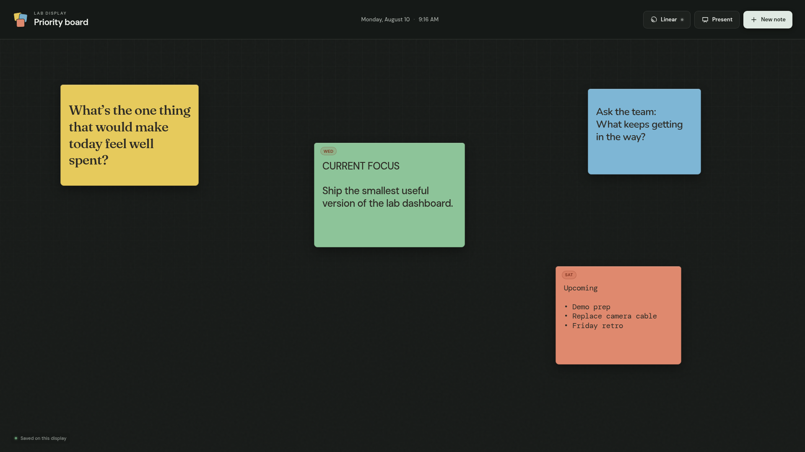

# Priority Board

A dark, free-form sticky-note board for the things a team needs to keep in view right now. It is designed for a shared office or lab display, without the lanes, statuses, or ceremony of a traditional kanban board.



## Features

- Create and edit notes directly on the board.
- Drag notes anywhere and resize them from the corner.
- Choose from six colors, four typefaces, and four text sizes.
- Add optional dates with clear due-soon and overdue labels.
- Hide the controls with presentation mode for an always-on display.
- Pull a focused, read-only feed from Linear without exposing credentials to the browser.
- Save automatically in the browser—no account or backend required.
- Use it with a mouse, touchscreen, or keyboard.

## Quick start

Priority Board has no runtime dependencies. Node.js 18 or newer is sufficient.

```bash
git clone https://github.com/parabuzzle/pboard.git
cd pboard
npm start
```

Open [http://localhost:4173](http://localhost:4173).

The server listens on the local network by default. Other devices can open `http://<display-computer-ip>:4173` while the server is running and the computer's firewall permits it.

## Controls

- Click **New note** and type directly on the card.
- Drag a card's narrow top edge to move it.
- Drag the bottom-right corner to resize it.
- Select a card to change its color, typeface, text size, or date.
- Press `Delete` or `Backspace` with a card selected to remove it.
- Press `P` for presentation mode; press `P` or `Escape` to exit.
- Press `Ctrl+Enter` or `Cmd+Enter` to create a note quickly.
- Click **Linear** to configure, refresh, filter, or restore hidden issue cards.
- Use **Hide cards** / **Show cards** in the top bar to temporarily toggle the entire Linear layer.

## Where the data lives

Notes are stored in the display browser's `localStorage` under the key `pboard.notes.v1`. They persist through refreshes and browser restarts, but they are tied to that browser profile and site address.

There is currently no synchronization or automatic backup. Clearing the site's browser data erases the board.

## Linear integration

Linear is an optional, one-way feed. Manual notes remain local and editable; Linear cards get their title, status, priority, assignee, and due date from Linear. You can still move, resize, recolor, or hide those cards on this display. Clicking the arrow on a card opens the source issue.

### Connect a workspace

1. Create a personal API key in [Linear's security settings](https://linear.app/settings/account/security).
2. Copy the example configuration:

   ```bash
   cp .env.example .env
   ```

3. Add the key to `.env`:

   ```dotenv
   LINEAR_API_KEY=lin_api_your_key_here
   ```

4. Restart `npm start`, click **Linear**, and select a team, optional project, due window, issue filter, and card limit.

The key is read only by `server.mjs`; it is never returned by an API endpoint or written to browser storage. `.env` is ignored by Git. OAuth access tokens are also supported through `LINEAR_ACCESS_TOKEN` and take precedence when both values are present.

### What gets displayed

The default **Due soon + active priority** filter includes incomplete issues that are overdue or due within the selected window. It also includes urgent and high-priority issues already in a started workflow state, even when they have no due date.

Choose **Only issues with due dates** to exclude every issue without a due date; the selected due window still applies. Overdue work is sorted first and the result is capped at the selected card limit.

The browser refreshes on startup and every ten minutes while visible. The server caches issue results for five minutes and team/project choices for ten minutes. The last successful issue response is kept in browser storage so a temporary Linear outage does not clear the display.

This first version is deliberately read-only. Editing an issue still happens in Linear.

## Contributing

Contributions are welcome. Read [CONTRIBUTING.md](CONTRIBUTING.md) before proposing a substantial change.

## License

Priority Board is available under the [MIT License](LICENSE).
